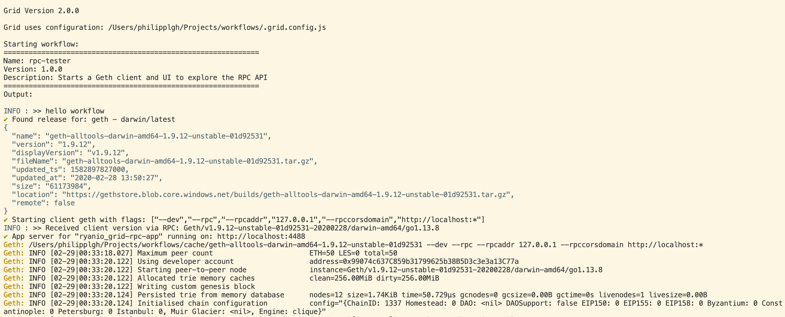

# Grid Workflows

This repository contains examples of Grid workflows.
Each workflow in this repo showcases different API aspects, concepts and techniques to achieve advanced infrastructure configurations in less than 10 lines of code.

___

## Block Explorer

### Description
This workflow starts a local Geth instance and configures the GraphQL API using the FlagBuilder.
It then starts the [BlocksApp](https://github.com/marcgarreau/grid-blocks-app) by @marcgarreau which connects over HTTP to Geth.
The Block Explorer can be used to learn more about the blockchain and explore and visualize blocks.
More information available in blog post: ["Ethereum 101: What’s a Blockchain?"](https://medium.com/ethereum-grid/ethereum-101-whats-a-blockchain-5a1e925963d7)

### Screenshots


### Concepts:
- Geth with GraphQL
- Loading a packaged web app with `ethpkg` and serving it locally
- Connecting a UI directly to a workflow binary over HTTP

## RPC Tester

### Description
This workflow starts a local Geth instance and connects the [RPC Tester App](https://github.com/ryanio/grid-rpc-app) by @ryanio to it.

### Screenshots

**RPC Tester UI**


**Workflow + Geth logs**

### Concepts:
- Geth with manual/raw flags (no FlagBuilder)
- Loading a packaged web app with `ethpkg` and serving it locally
- Connecting a UI directly to RPC
- Printing / managing Geth logs + colored output

## Ewasm Testnet

### Description


### Description
This workflow starts the Ewasm testnet in a Docker container, connects ethers.js to it and requests the `web3_clientVersion` over RPC.

### Concepts:
- Dockerfile in workflow
  - binaries are built using the docker builder pattern
  - docker entry point definition
  - binary as long running service
- FlagBuilder with .docker()

## REPL: Read–eval–print loop

### Description
This workflow starts a <**client**> instance.
`client` and `version` are flags that can be passed to the workflow to specify which client. Defaults are `geth` and `latest`.
It configures the RPC API with the FlagBuilder in a client agnostic way and connects ethers.js to it.
Last but not least the workflow enters a loop where it uses Grid's `prompt` API to ask the user for input and execute it as ethers.js commands.
The result is similar to the [JSRE REPL Console](https://github.com/ethereum/go-ethereum/wiki/JavaScript-Console) but with ethers.js and theoretically any client that can open an RPC endpoint.

### Concepts
- `prompt` user for input
- export run function parameter description
- processing of user provided flags: `--client=geth`

### Example Output
```
Grid Version 2.0.0
Grid uses configuration: /Users/philipplgh/Projects/workflows/.grid.config.js 

Starting workflow:
=============================================================
Name: ethers-repl
Version: 1.0.0
Description: This workflow creates Read–eval–print loop (REPL) and executes ethers.js commands on a local Geth instance.
=============================================================
Output:
              
INFO : >> hello repl
INFO : >> run with config { client: 'geth', version: 'latest' }
✔ Found release for: geth - darwin/latest
{
  "name": "geth-alltools-darwin-amd64-1.9.12-unstable-01d92531",
  "version": "1.9.12",
  "displayVersion": "v1.9.12",
  "fileName": "geth-alltools-darwin-amd64-1.9.12-unstable-01d92531.tar.gz",
  "updated_ts": 1582897827000,
  "updated_at": "2020-02-28 13:50:27",
  "size": "61173984",
  "location": "https://gethstore.blob.core.windows.net/builds/geth-alltools-darwin-amd64-1.9.12-unstable-01d92531.tar.gz",
  "remote": false
}
✔ Starting client geth with flags: ["--dev","--rpc","--rpcaddr","127.0.0.1","--rpccorsdomain","localhost:*,127.0.0.1:*"]
INFO : >> Received client version via RPC: Geth/v1.9.12-unstable-01d92531-20200228/darwin-amd64/go1.13.8
INFO : >> ethers.js:  4.0.40
INFO : Type something in this interactive ethers REPL
INFO : Try: ethereum.getNetwork()
> ethereum.getNetwork()
INFO : result: <Promise> =>  { chainId: 1337, name: 'unknown' }
> 
```

## GraphQL Explorer